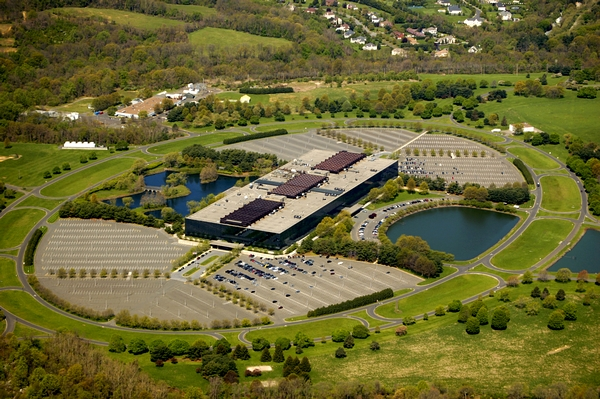
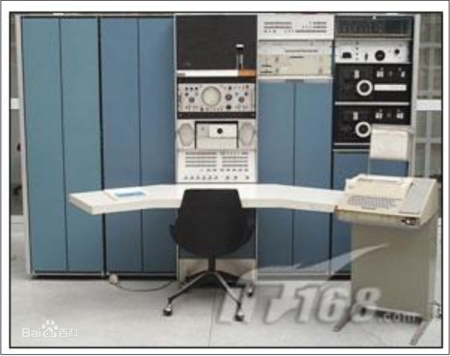
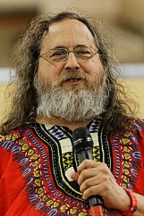
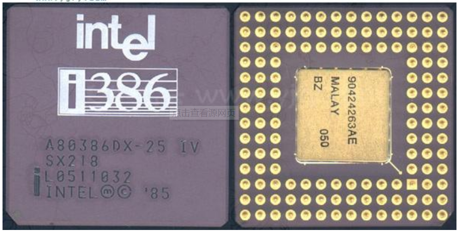
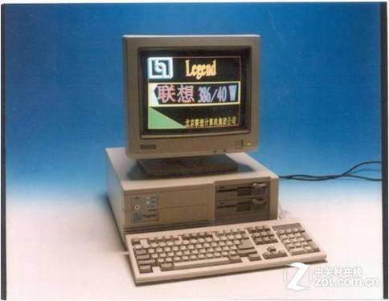
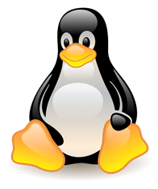

# Linux 内核发展史

## 随便说说

Linux 内核非常庞大，我说的非常大并不是为了吓唬大家，确实是非常多的代码，超过 600 万行的代码，所以我写文章介绍 Linux 内核，也不可能每一行代码去分析。

但是我希望我的文字略带微笑，略带邪恶，微笑着去面对这些代码，去面对 Linux 森林，然后你从这个森林走出来后，可以明白森林里的有哪些路，你下一次想带个妹子进去约会，就能找到合适的地方了。

虽然 Linux 内核非常庞大，但是横向对比计算机的发展史， Linux 的历史非常的简短，计算机出现的时候，正常跑的是裸机程序，学习计算机的同学应该很快明白什么是裸机程序，裸机程序只可以让一个进程使用硬件资源，这无形上对硬件资源的浪费。

可以拿我们的手机来比喻，裸机的话，我们玩王者荣耀的时候，有人打电话进来的话，王者荣耀是要被终止的，后来就有了操作系统，操作系统可以保证多任务执行，同样的 CPU 芯片，有了操作系统，我可以开微信，QQ ，还同时做其他很多事情。

## Unix 的诞生

**生日：**Unix 在 1969 年出生。

**他的父亲和母亲：** 是 Dennis Ritchie 和 Ken Thompson 两个人擦出了灵感的火花创造出来的。

**出生户籍地址：**贝尔实验室

**出生具体流程：**

1965 年，贝尔实验室要做一个项目，这个项目叫PDP-7计算机计划，发起人是通用电气和麻省理工学院，，他们给这个操作系统起了一个漂亮的名字叫做「MULTICS操作系统」（"Multiplexed Information and Computing Service"的缩写）。做事情总是有个计划，他们给这个操作系统给出的计划是，这个操作系统可以多个人使用，按照我们现在的人来说就是多用户系统，多任务，多层次等等。

到了1969 年，发起人觉得这个进度太慢了，本来想早点制造出来我们好用来玩电脑游戏的，结果你们这几个科学家整了这么久还是没整出来，那只好停掉了，停掉了投资方就不再提供后备的资源了，留下的东西就自己瞎整吧，投资方也不管了。

计划被停下来了，当时，Ken Thompson 在调试一个程序，这个程序名字叫做 “星级旅游”，这个程序运行在一个叫做 GE-635 的机器上面，但是因为这个机器的硬件设备比较落后，运行速度非常慢，这让Ken Thompson感觉非常不爽，然后他发现之前做「PDP-7计算机计划」项目的时候还有一台PDP-7计算机，这个计算机就是图片下面的那个计算机，当时应该没有人想到计算机可以做到这么小，然后他们就把 GE-635 程序移植到 PDP-7 计算机上面。

到了1970年，PDP-7 可以运行 GE-635程序了，但是却只能支持两个用户，当时 Brian Kernighan 就开玩笑的称他们的系统是 “UNiplexed Information and Computing Service”，这个缩写就是 UNICS，再后来，大家就取谐音，称为 UNIX。所以1970 年可以称为 UNIX元年。

## 自由的产物BSD

伯克利软件套件（英语：Berkeley Software Distribution，缩写为BSD），也被称为伯克利Unix（Berkeley Unix），是一个操作系统的名称。衍生于Unix（类Unix），1970年代由伯克利加州大学的学生比尔·乔伊（Bill Joy）开创，也被用来代表其衍生出的各种套件。

BSD常被当作工作站级别的Unix系统，这得归功于BSD用户许可证非常地宽松，许多1980年代成立的计算机公司，不少都从BSD中获益，比较著名的例子如DEC的Ultrix，以及Sun公司的SunOS。 1990年代，BSD很大程度上被System V 4.x版以及OSF/1系统所取代，但其开源版本被采用，促进了因特网的开发。

## GNU计划的产生

因为UNIX操作系统的商业化，原来的UNXI系统已经不能再被随意的使用，很多人都希望能有一款免费好用的操作系统，因为并不是每个人都很有钱，也不是每个人都能任性的自己去写操作系统，此时，理查·斯托曼在麻省理工学院人工智能实验室发起GNU计划，希望发展出一套完整的开放源代码操作系统来取代Unix，计划中的操作系统，名为GNU。 1983年9月27日，理查·斯托曼在 net.unix-wizards 和 net.usoft新闻组中公布这项计划。在此项计划中，开发出了很多我们现在熟悉的常用的工具，包括GNU编译器套装（GCC）、GNU的C库（glibc）、以及GNU核心工具组（coreutils）。另外也是GNU除错器（GDB）、GNU二进制实用程序（binutils）\\[15\\]的GNU Cash shell中\\[10\\] 和GNOME桌面环境。当然，GNU计划的目的还是开发出一款自由传播的操作系统，这个操作系统的名字叫Hurd，但是由于对操作系统的要求过高，以至于Hurd一直处于测试阶段，但是在后来的Linux加入到GNU弥补了这一空缺。

## 导火索MINIX

在Unix产生后，版权在AT&T手里，在Version 7 Unix发布之后，发布新的授权条款，将Unix源码私有化，在大学不得再使用Unix源码，荷兰阿姆斯特丹自由大学计算机科学系的塔能鲍姆教授为了教学,自己写了一个类Unix的小系统，命名为MINIX（意为mini-UNIX）。

## Linux 的出生

我们的主角人物，林纳斯 托瓦兹（Linus Torvalds）1991年，林纳斯·托瓦兹在赫尔辛基大学上学时，对操作系统很好奇。由于但是386BSD还没有出来。可是他不喜欢他的386电脑上的MS-DOS操作系统，所以就安装了Minix，可对MINIX只允许在教育上使用很不满（在当时MINIX不允许被用作任何商业使用），于是他便开始写他自己的操作系统。

Linux的第一个版本在1991年9月被大学FTP server管理员Ari Lemmke发布在Internet上，最初Torvalds称这个内核的名称为"Freax"，意思是自由（"free"）和奇异（"freak"）的结合字，并且附上"X"这个常用的字母，以配合所谓的类Unix的系统。但是FTP服务器管理员嫌原来的命名“Freax”的名称不好听，把内核的称呼改成“Linux”，当时仅有10000行程序码，仍必须运行于Minix操作系统之上，并且必须使用硬盘开机；随后在10月份第二个版本（0.02版）发布，同时这位芬兰赫尔辛基的大学生在comp.os.minix上发布一则消息

&gt; Hello everybody out there using minix- I'm doing a \(free\) operation system \(just a hobby, won't be big and professional like gnu\) for 386\(486\) AT clones.

1994年3月，Linux1.0版正式发布。为了让Linux可以在商业上使用，林纳斯·托瓦兹决定更改他原来的协议（这个协议会限制商业使用），以GNU GPL协议来代替。之后许多开发者致力融合GNU元素到Linux中，做出一个有完整功能的、自由的操作系统。

## Linux的标志物

Linux 的标志和吉祥物是一只名字叫做 Tux 的企鹅，标志的由来是因为 Linus 在澳洲时曾被一只动物园里的企鹅咬了一口，便选择企鹅作为 Linux的标志。更容易被接受的说法是：企鹅代表南极，而南极又是全世界所共有的一块陆地。这也就代表 Linux 是所有人的 Linux。

## Linux的现状

今天由Linus Torvalds带领下，众多开发共同参与开发和维护Linux内核。理查德·斯托曼领导的自由软件基金会，继续提供大量支持Linux内核的GNU组件。一些个人和企业开发的第三方的非GNU组件也提供对Linux内核的支持，这些第三方组件包括大量的作品，有内核模块和用户应用程序和库等内容。Linux社区或企业都推出一些重要的Linux发行版，包括Linux内核、GNU组件、非GNU组件，以及其他形式的的软件包管理系统软件。

